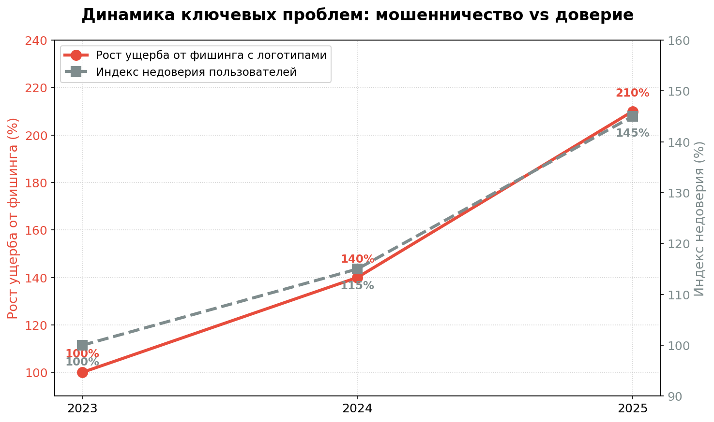
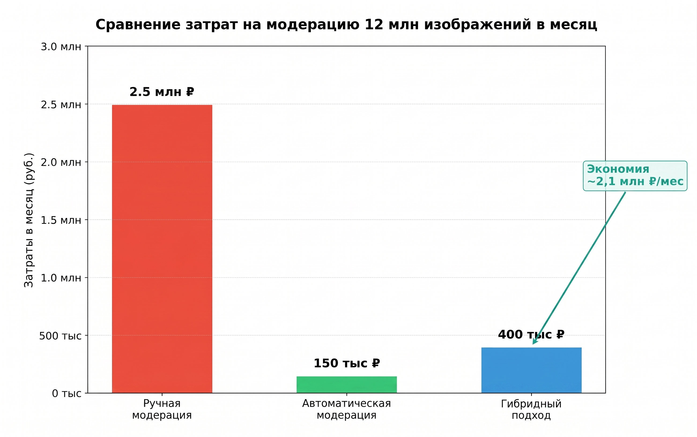

# Оценка потенциала проекта
## Проблема и актуальность

Пользователи платформ электронной коммерции систематически сталкиваются с мошенничеством, которое основано на использовании поддельных логотипов и ссылок. Это **приводит к значительным финансовым потерям и подрывает доверие к платформе.**
По данным Управления по организации борьбы с противоправным использованием ИКТ МВД России [1] **46%** всех преступлений в категории сайтов объявлений составляет **продажа несуществующих товаров и услуг**. За схемой часто скрываются фальшивые бренды и фишинг.
**12%** приходится на фишинг через **поддельные страницы оплаты**, что является прямой реализацией риска использования внешних ссылок и логотипов для введения в заблуждение.

Реальные кейсы, активно обсуждаемые пользователями в сети [2], подтверждают, что проблема киберпреступности является одним из ключевых факторов снижения лояльности аудитории.

## Научное обоснование
Авторы исследования "Online Fake Logo Detection System Using Machine Learning" подчеркивают, что поддельные логотипы становятся всё более похожими на подлинные, что делает традиционные методы обнаружения, такие как **ручная проверка, неэффективными**.[3]
Более того, задача осложняется маскировкой запрещенного контента. Исследование "A Deep Learning and AutoML-Based Multimodal Text Extraction Framework for Detecting Online Gambling Advertisements in Indonesian Social Media" показывает, что злоумышленники маскируют рекламу нелегальных сервисов, убирая текст из описания и помещая логотипы или призывы прямо на видеоряд или картинку. **Унимодальные (только текстовые) подходы больше не работают.** Для модерации платформ необходимо использовать связку из распознавания объектов и OCR на изображениях.[4]

## Экономический потенциал
Реализация нашего проекта открывает три вектора оптимизации прибыли:
- **Оптимизация операционных затрат:** Автоматизация поиска логотипов и ссылок позволяет кардинально снизить нагрузку на штат модераторов, перераспределив ресурсы на более сложные аналитические задачи.
- **Сохранение лояльности:** Снижение числа мошеннических операций напрямую влияет на удержание пользователей и их готовность совершать сделки внутри платформы.
- **Минимизация репутационных и юридических рисков:** Своевременное обнаружение запрещенной символики предотвращает наложение штрафов, риск блокировок со стороны регуляторов, а также сохраняет доверие крупных рекламодателей и партнеров.

Ежедневно Авито обрабатывает около 20 млн объявлений, из которых 400 тысяч уходят на ручную проверку. В месяц через модераторов проходит 12 миллионов изображений.

Ручная модерация каждого изображения достаточно точная, но требует больших денежных ресурсов. Также при таком варианте сложно масштабироваться, если трафик вырастет, то пользователям придется ждать в разы дольше, что приведет к негативному опыту использования платформы. 
Автоматическая модерация - это самый дешевый вариант, однако есть риск ложных срабатываний или пропуска сложных случаев.
Гибридный подход является оптимальным. Модель берет на себя основной поток данных, а изображения с низким коэффициентом уверенности направляются на дополнительную ручную проверку. Внедрение гибридной системы позволяет экономить **~2,1 млн рублей ежемесячно** (более 25 млн рублей в год) только на одном бизнес-процессе модерации.

# Есть ли простое решение? Насколько оно решает задачу?
## 1. **Проверка человеком**

Наиболее простым решением поставленной задачи является ручная проверка загруженных фотографий человеком. У данного способа можно выделить следующие преимущества:
- Человек способен распознавать контекст, иронию, культурные отсылки и завуалированные нарушения, с которыми базовые алгоритмы не справляются.
- Опытные модераторы могут выявлять абсолютно новые мошеннические схемы, для распознавания которых у нейросетей еще нет достаточной обучающей выборки.
- Низкий риск ложных блокировок.
- Отсутствие стартовых затрат на разработку.

Однако этот подход имеет ряд серьёзных недостатков:

- Низкая скорость модерации.
- Высокие и постоянные затраты.
- Проблемы масштабируемости, при всплесках трафика систему невозможно быстро расширить.
- Влияние человеческого фактора.
- Необходимость расширять штат сотрудников (дополнительные затраты ресурсов HR-специалистов, отдела контроля качества, необходимость регулярно проводить обучение из-за высокой текучести кадров).

Человек по-прежнему превосходит алгоритмы в точности визуального анализа, но лишь при условии неограниченного времени, такой подход практически нереализуем при большом объёме данных. Возможным является вариант проведения конечной модерации ограниченного объёма фотографий человеком, после отсеивания основной массы моделью.

## 2. **Сравнение по шаблону**

(Поиск точного совпадения пикселей)
Преимущества подхода:
- Хорошо работает при обнаружении стандартных цифровых штампов на фотографии.
- Высокая скорость.
- Простота масштабирования.

Главный недостаток подхода - это неустойчивость к любым, даже самым простым, изменениям (шум, наклон, масштаб). Злоумышленник без особых усилий сможет обойти такую модерацию, поэтому этот метод не подходит для решения нашей задачи.

Однако в определённых ситуациях (например, при наличии большого количества фото с однотипными водяными знаками) может использоваться как первая ступень фильтрации, что позволит  сократить объём данных для последующей обработки более тяжелой моделью. 

# Реалистичность решения проблемы с помощью ML
Детекция и распознавание логотипов является классической задачей в современной индустрии Computer Vision. Она успешно решается в таких продуктах как Google Lens, Pinterest Visual Search и в системах автоматической модерации крупных маркетплейсов Amazon, Alibaba.

Современные архитектуры семейств YOLO, EfficientDet и Faster R-CNN эффективно находят мелкие объекты на зашумленных изображениях. Принципиальная возможность создания модели подтверждается наличием крупных открытых датасетов (например, LogoDet-3K, WebLogo-2M), на которых исследователи уже достигли высоких результатов.

Для задач детекции логотипов достижимы значения mAP (mean Average Precision) на уровне 0.85–0.95, что является достаточным для автоматизации 90% процессов модерации.

При этом важно учитывать границы применимости и потенциальные сложности реального контента, которые могут снизить точность модели:
- Низкое качество или смазанность пользовательских фотографий
- Окклюзия (логотип частично перекрыт бликом, пальцем, ценником или деформирован на складках одежды)
- Постоянное появление новых логотипов
Несмотря на эти сложности, использование ML реализуемо и экономически выгодно для бизнеса. 
# Технические требования к задаче
Для реализации бизнес-логики модерации на этапе прототипа сервис должен обеспечивать баланс между точностью распознавания и скоростью обработки. Наши целевые технические требования: 
1) Latency ≤ 1000 мс на одно изображение
2) 60-120 Img/min на один инстанс
3) Batch Speedup Ratio > 1.5x при батче размера 8 по сравнению с последовательной обработкой

Мы намеренно не фокусируемся на тысячах запросов в секунду, так как для модерации важнее консистентность и предсказуемое время обработки каждого кадра.

# Выделение ресурсов команды на интеграцию
С нашей стороны основной объем работ ложится на **ML-инженера** (разработка и дообучение модели, настройка API-пайплайнов, оценка точности), и на **DevOps-инженера** (разворачивание сервиса в контуре Avito, настройка автомасштабирования, алертинг). За общую координацию проекта и синхронизацию работы со стейкхолдерами отвечает **технический менеджер**.
Со стороны продуктовой команды для интеграции потребуется помощь **Backend-разработчика** (встраивание сервиса в пайплайн публикации объявления, обработка событий) и **Frontend-разработчика** (разработка интерфейса для модераторов и панели администрирования). Кроме того, для успешного старта нужен опытный модератор. Он поможет проверить точность нейросети на реальных примерах и правильно настроить правила блокировки.

[1]: https://www.tadviser.ru/index.php/Статья:Сайты_объявлений_в_России
[2]: https://www.pvsm.ru/moshennichestvo-v-internete/438123
[3]: https://iarjset.com/wp-content/uploads/2025/01/IARJSET.2025.12112-1.pdf
[4]: https://www.researchgate.net/publication/398900970_A_Deep_Learning_and_AutoML-Based_Multimodal_Text_Extraction_Framework_for_Detecting_Online_Gambling_Advertisements_in_Indonesian_Social_Media
