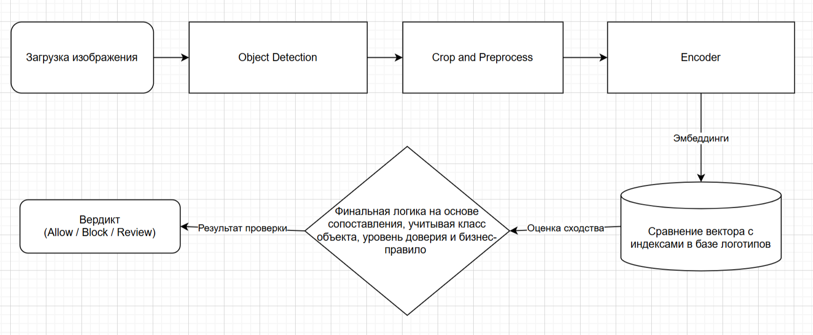

# Решение с примером использования

## Пример использования
1) Пользователь загружает фотографии товара или вакансии при подаче объявления
2) Алгоритм анализирует изображение, обнаруживает область с логотипом, символикой и делает кроп этого объекта
3) По вырезанному фрагменту система вычисляет эмбеддинг и находит в базе данных соответствующий бренд, ссылку или тип символики
4) Сервис валидирует найденные объекты согласно правилам и выносит вердикт
# Бизнес-метрики
Главная бизнес-метрика:

Защитные метрики:

# Метрика машинного обучения
